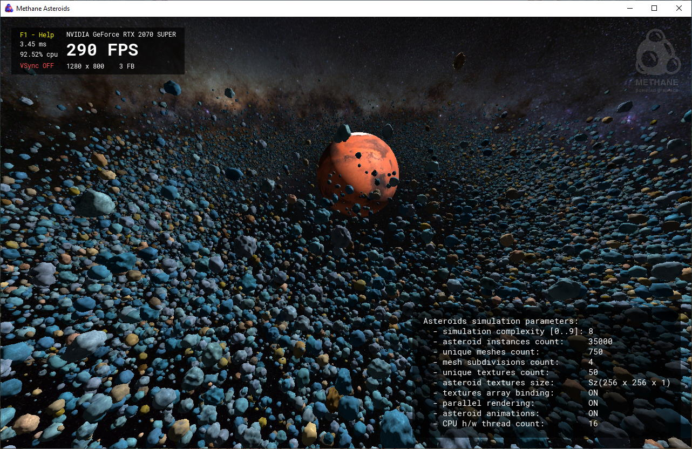
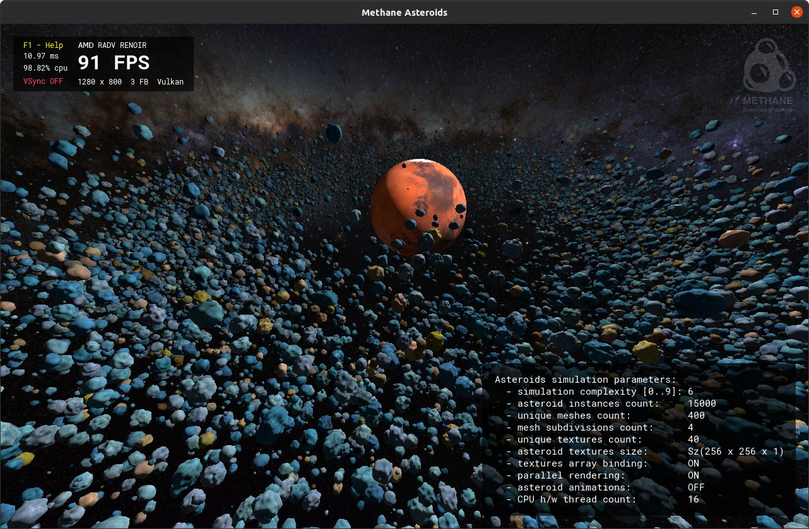
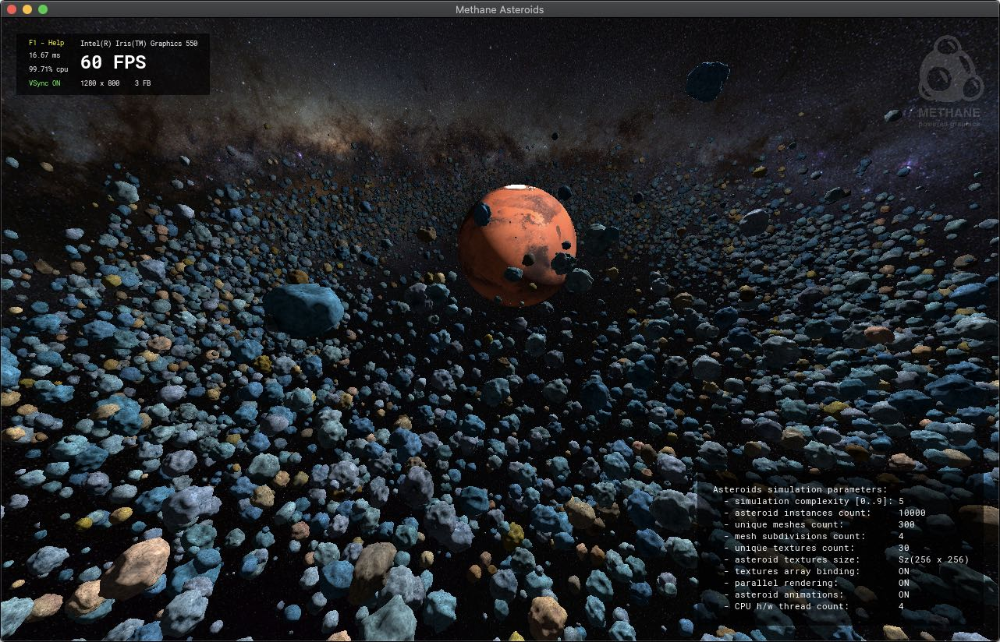
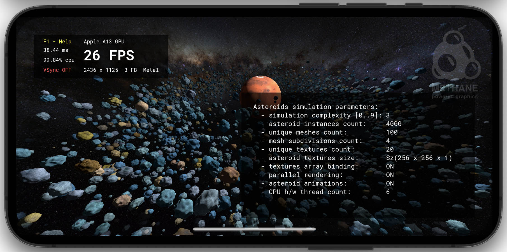
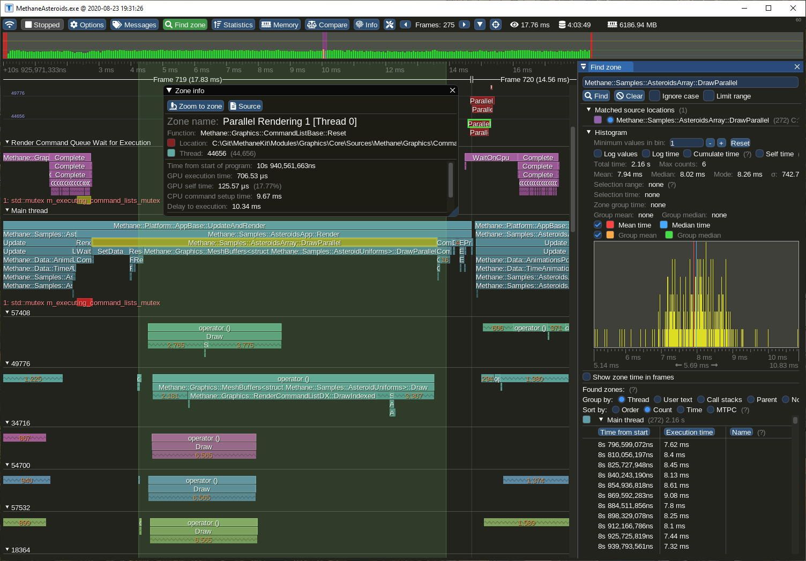
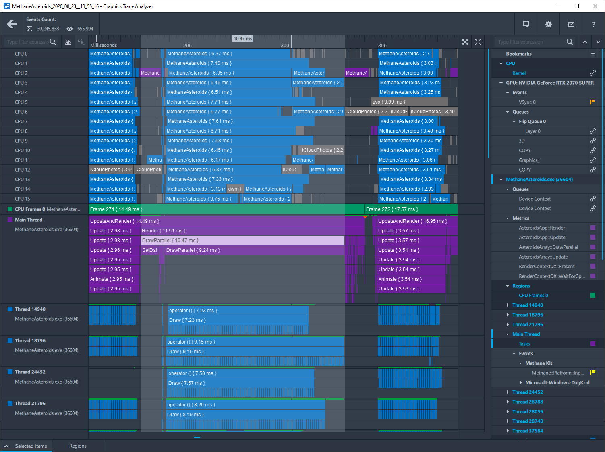

# Methane Asteroids Sample 

Asteroids sample demonstrates multi-threaded rendering of large number of random-generated asteroids 
with **[Methane Kit](https://github.com/MethanePowered/MethaneKit) library** using one of modern graphics APIs 
(DirectX 12, Vulkan or Metal) and platform independent implementation.
Thousands of unique asteroid instances (1000-50000) are drawn with individual draw-call parameters in parallel with a random combination of:
- random-generated mesh (from array of up to 1000 unique meshes),
- random generated perlin-noise array texture each with 3 projections (from array of up to 50 unique textures),
- random combination of coloring (from 72 color combinations).

Methane Asteroids sample was inspired by [Intel Asteroids D3D12](https://github.com/GameTechDev/asteroids_d3d12),
but implemented from scratch in a cross-platform style using [Methane Kit](https://github.com/MethanePowered/MethaneKit).

| <pre><b>Platform  </b></pre>                                                                                                            | <pre><b>Graphics API</b></pre>                                                                                                                                                                                                                                                                            | <pre><b>Screenshot                                            </b></pre> |
|-----------------------------------------------------------------------------------------------------------------------------------------|-----------------------------------------------------------------------------------------------------------------------------------------------------------------------------------------------------------------------------------------------------------------------------------------------------------|--------------------------------------------------------------------------|
|  Windows |  DirectX 12   Vulkan |            |
|  Linux     |  Vulkan                                                                                                                                                              |                 |
|  MacOS     |  Metal                                                                                                                                                                |                  |
|  iOS, tvOS   |  Metal                                                                                                                                                                |                    |

## [Build Instructions](/Build/README.md)

- [Prerequisites](/Build/README.md#prerequisites)
- [Fetch Sources](/Build/README.md#fetch-sources)
  - [Notes](/Build/README.md#notes)
  - [First time initialization](/Build/README.md#first-time-initialization)
  - [Update sources to latest revision](/Build/README.md#update-sources-to-latest-revision)
- [Building from Sources](/Build/README.md#building-from-sources)
  - [Windows Build with Visual Studio](/Build/README.md#windows-build-with-visual-studio)
  - [Linux Build with Unix Makefiles](/Build/README.md#linux-build-with-unix-makefiles)
  - [MacOS Build with XCode](/Build/README.md#macos-build-with-xcode)
  - [iOS and tvOS Build with XCode](/Build/README.md#macos-build-with-xcode)
- [CMake Generator](/Build/README.md#cmake-generator)
  - [CMake Options](/Build/README.md#cmake-options)
  - [CMake Presets](/Build/README.md#cmake-presets)

## Features

Default parameters of asteroids simulation are selected depending on CPU HW cores count and are displayed 
in right-bottom panel (switched with `F3` key).
Overall scene complexity can be reduced or increased by pressing `[` / `]` keys.
Sample renders galaxy background using [Methane::Graphics::SkyBox](https://github.com/MethanePowered/MethaneKit/tree/master/Modules/Graphics/Extensions/Include/Methane/Graphics/SkyBox.h)
and planet using generated [Methane::Graphics::SphereMesh](https://github.com/MethanePowered/MethaneKit/tree/master/Modules/Graphics/Primitives/Include/Methane/Graphics/Mesh/SphereMesh.hpp)
with spherical texture coordinates. It also uses interactive [Arc-Ball camera](https://github.com/MethanePowered/MethaneKit/tree/master/Modules/Graphics/Camera/Include/Methane/Graphics/ArcBallCamera.h)
rotated with mouse `LMB` and light rotated with `RMB` with keyboard shortcuts also available (see in help by `F1` key).

## Rendering Optimizations

- Asteroid meshes use **dynamically selected LODs** depending on estimated screen size.
  This allows to greatly reduce GPU overhead. Use `L` key to enable LODs coloring and `'` / `;` keys to increase / reduce overall mesh level of details.
- **Parallel rendering** of asteroids array with individual draw-calls allows to be less CPU bound.
  Multi-threading can be switched off for comparing with single-threaded rendering by pressing `P` key.
- **Parallel updating** of asteroid transformation matrices in [AsteroidsArray::Update](/Modules/Simulation/AsteroidsArray.cpp#L352) and
  encoding asteroid meshes rendering in [MeshBuffers::DrawParallel](https://github.com/MethanePowered/MethaneKit/tree/master/Modules/Graphics/Extensions/Include/Methane/Graphics/MeshBuffers.hpp#L160)
  are implemented using [Taskflow](https://github.com/taskflow/taskflow/) library which enables effective usage of the thread-pool via `parallel_for` primitive.
- All asteroid textures are bound to program uniform all at once as an **array of textures** to minimize number of program binding calls between draws.
  Particular texture is selected on each draw call using index parameter in constants buffer.
  Note that each asteroid texture is a texture 2d array itself with 3 mip-mapped textures used for triplane projection.
- **Inverted depth buffer** (with values from 1 in foreground to 0 in background and greater-or-equal compare function)
  is used to minimize frame buffer overdrawing by rendering in order from foreground to background: asteroids array with planet
  are drawn first and sky-box afterwards.

## Controls

### Keyboard actions

| Keyboard Action                     | Shortcut             | Controller                                                                                                                                                       | 
|-------------------------------------|----------------------|------------------------------------------------------------------------------------------------------------------------------------------------------------------|
| **APPLICATION SETTINGS**            |                      |                                                                                                                                                                  |
| Show controls help                  | `F1`                 | [Platform::AppController](https://github.com/MethanePowered/MethaneKit/blob/master/Modules/Platform/App/Include/Methane/Platform/AppController.h)                |
| Show command-line help              | `F2`                 | [Platform::AppController](https://github.com/MethanePowered/MethaneKit/blob/master/Modules/Platform/App/Include/Methane/Platform/AppController.h)                |
| Show parameters                     | `F3`                 | [Platform::AppController](https://github.com/MethanePowered/MethaneKit/blob/master/Modules/Platform/App/Include/Methane/Platform/AppController.h)                |
| Switch heads-up-display mode        | `F4`                 | [UserInterface::AppController](https://github.com/MethanePowered/MethaneKit/blob/master/Modules/UserInterface/App/Include/Methane/UserInterface/AppController.h) |
| Switch full-screen                  | `LCtrl` + `F`        | [Platform::AppController](https://github.com/MethanePowered/MethaneKit/blob/master/Modules/Platform/App/Include/Methane/Platform/AppController.h)                |
| Close application                   | `LCtrl`/`LCmd` + `Q` | [Platform::AppController](https://github.com/MethanePowered/MethaneKit/blob/master/Modules/Platform/App/Include/Methane/Platform/AppController.h)                |
| Switch animations on/off            | `LCtrl` + `P`        | [Graphics::AppController](https://github.com/MethanePowered/MethaneKit/blob/master/Modules/Graphics/App/Include/Methane/Graphics/AppController.h)                |
| **GRAPHICS CONTEXT SETTINGS**       |                      |                                                                                                                                                                  |
| Switch vertical synchronization     | `LCtrl` + `V`        | [Graphics::AppContextController](https://github.com/MethanePowered/MethaneKit/blob/master/Modules/Graphics/App/Include/Methane/Graphics/AppContextController.h)  |
| Switch device used for rendering    | `LCtrl` + `X`        | [Graphics::AppContextController](https://github.com/MethanePowered/MethaneKit/blob/master/Modules/Graphics/App/Include/Methane/Graphics/AppContextController.h)  |
| Add frame buffer to swap-chain      | `LCtrl` + `+`        | [Graphics::AppContextController](https://github.com/MethanePowered/MethaneKit/blob/master/Modules/Graphics/App/Include/Methane/Graphics/AppContextController.h)  |
| Remove frame buffer from swap-chain | `LCtrl` + `-`        | [Graphics::AppContextController](https://github.com/MethanePowered/MethaneKit/blob/master/Modules/Graphics/App/Include/Methane/Graphics/AppContextController.h)  |
| **VIEW CAMERA**                     |                      |                                                                                                                                                                  |
| Move camera left                    | `A`                  | [Graphics::AppCameraController](https://github.com/MethanePowered/MethaneKit/blob/master/Modules/Graphics/App/Include/Methane/Graphics/AppCameraController.h)    |
| Move camera right                   | `D`                  | [Graphics::AppCameraController](https://github.com/MethanePowered/MethaneKit/blob/master/Modules/Graphics/App/Include/Methane/Graphics/AppCameraController.h)    |
| Move camera forward                 | `W`                  | [Graphics::AppCameraController](https://github.com/MethanePowered/MethaneKit/blob/master/Modules/Graphics/App/Include/Methane/Graphics/AppCameraController.h)    |
| Move camera backward                | `S`                  | [Graphics::AppCameraController](https://github.com/MethanePowered/MethaneKit/blob/master/Modules/Graphics/App/Include/Methane/Graphics/AppCameraController.h)    |
| Move camera up                      | `Page Up`            | [Graphics::AppCameraController](https://github.com/MethanePowered/MethaneKit/blob/master/Modules/Graphics/App/Include/Methane/Graphics/AppCameraController.h)    |
| Move camera down                    | `Page Down`          | [Graphics::AppCameraController](https://github.com/MethanePowered/MethaneKit/blob/master/Modules/Graphics/App/Include/Methane/Graphics/AppCameraController.h)    |
| Yaw camera left                     | `Left`               | [Graphics::AppCameraController](https://github.com/MethanePowered/MethaneKit/blob/master/Modules/Graphics/App/Include/Methane/Graphics/AppCameraController.h)    |
| Yaw camera right                    | `Right`              | [Graphics::AppCameraController](https://github.com/MethanePowered/MethaneKit/blob/master/Modules/Graphics/App/Include/Methane/Graphics/AppCameraController.h)    |
| Pitch camera up                     | `Up`                 | [Graphics::AppCameraController](https://github.com/MethanePowered/MethaneKit/blob/master/Modules/Graphics/App/Include/Methane/Graphics/AppCameraController.h)    |
| Pitch camera down                   | `Down`               | [Graphics::AppCameraController](https://github.com/MethanePowered/MethaneKit/blob/master/Modules/Graphics/App/Include/Methane/Graphics/AppCameraController.h)    |
| Roll camera left                    | `<`                  | [Graphics::AppCameraController](https://github.com/MethanePowered/MethaneKit/blob/master/Modules/Graphics/App/Include/Methane/Graphics/AppCameraController.h)    |
| Roll camera right                   | `>`                  | [Graphics::AppCameraController](https://github.com/MethanePowered/MethaneKit/blob/master/Modules/Graphics/App/Include/Methane/Graphics/AppCameraController.h)    |
| Zoom camera in                      | `+`                  | [Graphics::AppCameraController](https://github.com/MethanePowered/MethaneKit/blob/master/Modules/Graphics/App/Include/Methane/Graphics/AppCameraController.h)    |
| Zoom camera out                     | `-`                  | [Graphics::AppCameraController](https://github.com/MethanePowered/MethaneKit/blob/master/Modules/Graphics/App/Include/Methane/Graphics/AppCameraController.h)    |
| Change camera pivot                 | `LAlt` + `P`         | [Graphics::AppCameraController](https://github.com/MethanePowered/MethaneKit/blob/master/Modules/Graphics/App/Include/Methane/Graphics/AppCameraController.h)    |
| Reset camera orientation            | `LAlt` + `R`         | [Graphics::AppCameraController](https://github.com/MethanePowered/MethaneKit/blob/master/Modules/Graphics/App/Include/Methane/Graphics/AppCameraController.h)    |
| **LIGHT SOURCE**                    |                      |                                                                                                                                                                  |
| Reset light orientation             | `LCtrl` + `L`        | [Graphics::AppCameraController](https://github.com/MethanePowered/MethaneKit/blob/master/Modules/Graphics/App/Include/Methane/Graphics/AppCameraController.h)    |
| **ASTEROIDS SETTINGS**              |                      |                                                                                                                                                                  |
| Switch Parallel Rendering           | `P`                  | [Samples::AsteroidsAppController](/App/AsteroidsAppController.h)                                                                                                 |
| Switch Mesh LODs Coloring           | `L`                  | [Samples::AsteroidsAppController](/App/AsteroidsAppController.h)                                                                                                 |
| Increase Mesh LOD Complexity        | `'`                  | [Samples::AsteroidsAppController](/App/AsteroidsAppController.h)                                                                                                 |
| Decrease Mesh LOD Complexity        | `;`                  | [Samples::AsteroidsAppController](/App/AsteroidsAppController.h)                                                                                                 |
| Increase Scene Complexity           | `]`                  | [Samples::AsteroidsAppController](/App/AsteroidsAppController.h)                                                                                                 |
| Decrease Scene Complexity           | `[`                  | [Samples::AsteroidsAppController](/App/AsteroidsAppController.h)                                                                                                 |
| Set Scene Complexity 0 .. 9         | `0..9`               | [Samples::AsteroidsAppController](/App/AsteroidsAppController.h)                                                                                                 |

### Mouse actions

| Mouse action     | Mouse Button      | Controller                                                                                                                                                    |
|------------------|-------------------|---------------------------------------------------------------------------------------------------------------------------------------------------------------|
| **VIEW CAMERA**  |                   |                                                                                                                                                               |
| Rotate camera    | Left Button       | [Graphics::AppCameraController](https://github.com/MethanePowered/MethaneKit/blob/master/Modules/Graphics/App/Include/Methane/Graphics/AppCameraController.h) |
| Zoom camera      | Ver. Scroll Wheel | [Graphics::AppCameraController](https://github.com/MethanePowered/MethaneKit/blob/master/Modules/Graphics/App/Include/Methane/Graphics/AppCameraController.h) |
| Move camera      | Middle Button     | [Graphics::AppCameraController](https://github.com/MethanePowered/MethaneKit/blob/master/Modules/Graphics/App/Include/Methane/Graphics/AppCameraController.h) |
| **LIGHT SOURCE** |                   |                                                                                                                                                               |
| Rotate Light     | Right Button      | [Graphics::AppCameraController](https://github.com/MethanePowered/MethaneKit/blob/master/Modules/Graphics/App/Include/Methane/Graphics/AppCameraController.h) |

### Command line

| Argument                  | Value (Default)     | Description                                                   | 
|---------------------------|---------------------|---------------------------------------------------------------|
| **APPLICATION SETTINGS**  |                     |                                                               |
| `-h`, `--help`            | -                   | Print help message and exit                                   |
| `-w`, `--wnd-size`        | `W H` (`0.8 0.8`)   | Window size in pixels or as ratio of desktop size             |
| `-f`, `--full-screen`     | `0` / `1` (`0`)     | Full-screen mode                                              |
| `-a`, `--animations`      | `0` / `1` (`1`)     | Enable animations                                             |
| `-d`, `--device`          | `-1` / `0..N` (`0`) | Render at adapter index, use -1 for software adapter          |
| `-v`, `--vsync`           | `0` / `1`           | Vertical synchronization                                      |
| `-b`, `--frame-buffers`   | `0..N` (`3`)        | Frame buffers count in swap-chain                             |
| `-i`, `--hud`             | `0..2` (`2`)        | HUD display mode (0 - hidden, 1 - in window title, 2 - in UI) |
| **ASTEROIDS SETTINGS**    |                     |                                                               |
| `-c`, `--complexity`      | `0..9`              | Asteroids simulation complexity                               |
| `-s`, `--subdiv-count`    | `1..N`              | Mesh subdivisions count                                       |
| `-t`, `--texture-array`   | `0` / `1` (`0`)     | Texture array enabled                                         |
| `-r`, `--parallel-render` | `0` / `1` (`1`)     | Parallel rendering enabled                                    |

## Instrumentation and Profiling

[Integrated instrumentation of the Methane Kit](https://github.com/MethanePowered/MethaneKit/blob/master/Modules/Common/Instrumentation/README.md) 
library and Asteroids sample enables profiling with the following tools:
- [Tracy Profiler](https://github.com/wolfpld/tracy)
- [Intel GPA Trace Analyzer](https://software.intel.com/en-us/gpa/graphics-trace-analyzer)
- [Intel VTune Profiler](https://software.intel.com/content/www/us/en/develop/tools/vtune-profiler.html)

| [Tracy Frame Profiler](https://github.com/wolfpld/tracy)                | [Intel Graphics Trace Analyzer](https://software.intel.com/en-us/gpa/graphics-trace-analyzer) |
|-------------------------------------------------------------------------|-----------------------------------------------------------------------------------------------|
|  |         |

## [External Dependencies](/Externals/README.md)

- [Libraries](/Externals/README.md#libraries)
- [Build Tools](/Externals/README.md#build-tools)
- [Assets](/Externals/README.md#assets)

## License

Methane Asteroids sample along with Methane Kit are distributed under [Apache 2.0 License](LICENSE): it is free to use and open for contributions!

*Copyright 2019-2022 © Evgeny Gorodetskiy* 
